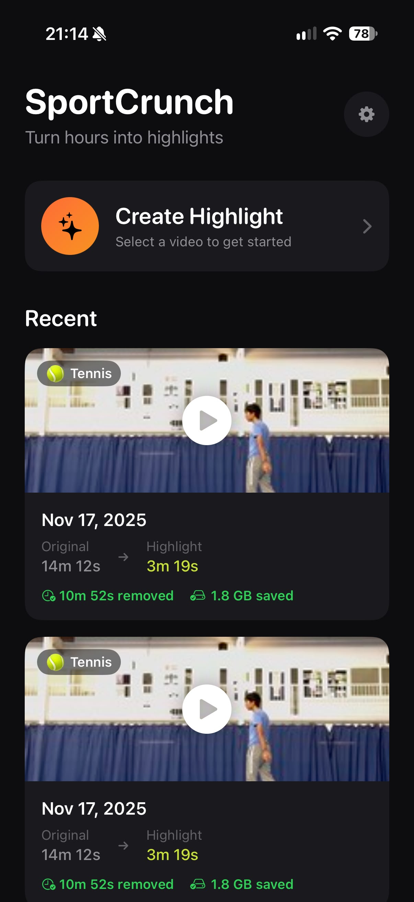

# SportCrunch

Turn hours of tennis footage into highlights — automatically, entirely on-device.

## What it does

SportCrunch takes videos of your tennis sessions (shot from any angle) and extracts the rallies and shots that matter. It correlates the audio (racket hits) with motion in the frame to detect points of interest, then cuts a long session down to a compact highlights reel — in seconds, with no cloud upload.

Built for self-analysis: instead of scrubbing through hours of side-on footage to review technique, I get a short reel of my actual rallies. The approach generalizes to other racket sports (e.g. badminton).

## Screenshots

